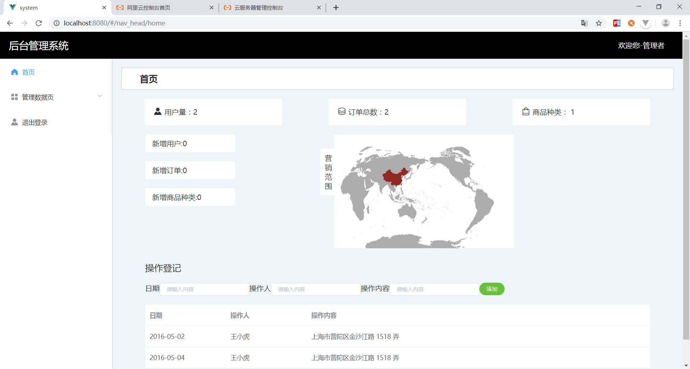
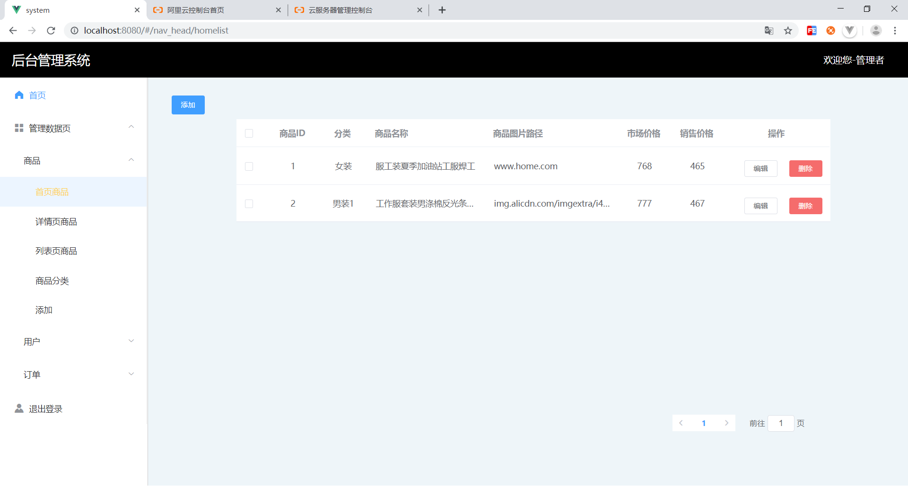

## 后台管理系统

### tree

```
|-- README.md
|-- babel.config.js
|-- nodejs
|   |-- config.json
|   |-- package-lock.json
|   |-- package.json
|   |-- router
|   |   |-- add.js
|   |   |-- content_db.js
|   |   |-- home.js
|   |   |-- index.js
|   |   |-- list.js
|   |   |-- login.js
|   |   |-- order.js
|   |   `-- user.js
|   `-- server.js
|-- package-lock.json
|-- package.json
|-- public
|   |-- base.css
|   |-- favicon.ico
|   `-- index.html
`-- src
    |-- App.vue
    |-- assets
    |   |-- logo.png
    |   `-- map.jpg
    |-- components
    |   `-- HelloWorld.vue
    |-- html
    |   |-- Add.vue
    |   |-- Detaillist.vue
    |   |-- Home.vue
    |   |-- Homelist.vue
    |   |-- Kindlist.vue
    |   |-- Listdouble.vue
    |   |-- Login.vue
    |   |-- Orderlist.vue
    |   |-- Userslist.vue
    |   `-- nav_head.vue
    |-- main.js
    |-- router
    |   `-- index.js
    `-- store
        `-- index.js
```

* **编写人员**：刘钦博

* **相应功能**：基本的增删改查。

     首页的功能，统计订单数，用户量，商品种类。还有对应的新增的。 用户与订单与只是展示。

     ​	         其他的list都有对应的增删改查功能。增是在对应的页面点击添加跳到对应的页面，再输入数据，写     进数据库对应的表格。改是将其原本能容传到add页面，点击提交后进入数据库格与id查到对应的数据进行修改

     ​		
     				
     		

